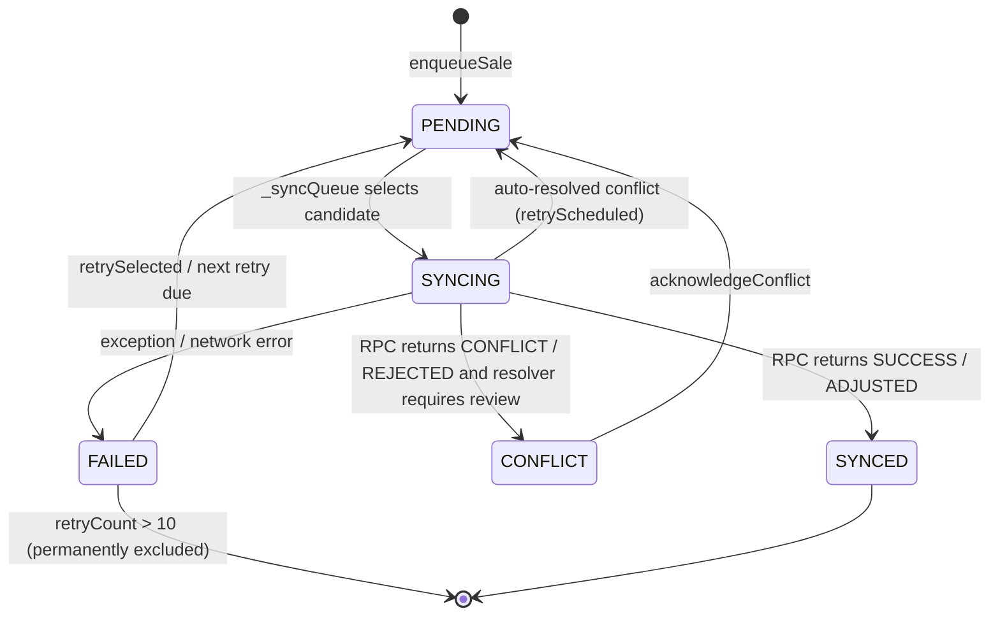

# Application Contract Reconciliation

**Auditor:** Dracarys (Hermes Agent, model: Kimi K2.7 Code)
**Date:** 2026-07-24
**Branch:** `fix/storefront-categories-cdn-and-hero-image`
**Scope:** Read-only forensic reconciliation of transactional contracts, offline synchronization guarantees, and database dependencies across `admin_web`, `customer_storefront`, `mobile_app`, Supabase Edge Functions, and Cloudflare Workers.

**Authorization:** Read-only inspection only. No files modified, no migrations created, no database writes, no production connections, no deployments.

---

## 0. Methodology

This audit treats the Kimi 2.7 audit (`docs/audit/kimi2.7audit.md`) and the GLM 5.2 database audit (`docs/audit/glm5.2audit.md`) as hypotheses requiring independent verification. Every claim below is traced to exact source files and line numbers. Where repository migrations conflict or cannot prove live database state, the finding is qualified as `DATABASE CONTRACT REQUIRED` or `LIVE-STATE REQUIRED`.

Key files inspected:

- `apps/admin_web/src/lib/api/domains/pos.ts`
- `apps/admin_web/src/features/pos/usePosSale.ts`
- `apps/admin_web/src/features/pos/QuickPosPage.tsx`
- `apps/admin_web/src/features/inventory/AddProductModal.tsx`
- `apps/admin_web/src/lib/api/domains/inventory.ts`
- `apps/admin_web/src/lib/api/domains/settings.ts`
- `apps/admin_web/src/lib/api/domains/products.ts`
- `apps/admin_web/src/lib/api/domains/dailySales.ts`
- `apps/admin_web/src/lib/api/domains/competitorPrices.ts`
- `apps/admin_web/src/lib/api/domains/expenses.ts`
- `apps/admin_web/src/lib/api/domains/otherIncome.ts`
- `apps/admin_web/src/hooks/useInventoryEditing.ts`
- `apps/admin_web/src/features/finance/LedgerPage.tsx`
- `apps/admin_web/src/features/import/ImportProductsPage.tsx`
- `apps/customer_storefront/app/lib/orders.ts`
- `apps/customer_storefront/app/api/checkout/route.ts`
- `apps/customer_storefront/app/lib/wishlist.ts`
- `apps/customer_storefront/app/api/wishlist/route.ts`
- `apps/mobile_app/lib/shared/providers/pos_provider.dart`
- `apps/mobile_app/lib/shared/services/edge_function_sale_service.dart`
- `apps/mobile_app/lib/features/sales/offline_transaction_sync_service.dart`
- `apps/mobile_app/lib/features/sales/conflict_resolver.dart`
- `apps/mobile_app/lib/models/sale_transaction_snapshot.dart`
- `apps/mobile_app/lib/offline/manager.dart`
- `apps/mobile_app/lib/offline/db.dart`
- `apps/mobile_app/test/integration/offline_sync_test.dart`
- `apps/mobile_app/test/MANUAL_TEST_CHECKLIST.md`
- `supabase/functions/create-sale/index.ts`
- `supabase/functions/adjust-stock/index.ts`
- `supabase/functions/import-inventory/index.ts`
- `supabase/migrations/20260601000001_fix_create_sale_column_names.sql`
- `supabase/migrations/20260530000000_final_dedupe_cleanup.sql`
- `supabase/migrations/20260506100000_rpc_consolidation_and_security.sql`
- `supabase/migrations/20260301000000_baseline_core_tables.sql`
- `supabase/migrations/20260611000002_add_orders.sql`
- `supabase/migrations/20260423232000_production_hardening.sql`
- `supabase/migrations/20260327100000_stock_levels_realtime_and_rpc.sql`
- `supabase/migrations/20260423230000_lean_inventory_rpcs.sql`
- `supabase/migrations/20260506000003_repair_stock_and_reminder_functions.sql`
- `apps/admin_web/src/lib/database.types.ts`

---

## 1. Executive conclusion

### Direct answers

- **What sale path does each client actually use?**
  - **Admin web POS:** calls `create_sale` RPC directly from `apps/admin_web/src/lib/api/domains/pos.ts:71`. The idempotency key is generated at `apps/admin_web/src/features/pos/usePosSale.ts:190`.
  - **Mobile online POS:** tries the `create-sale` Edge Function first for single-tender sales (`apps/mobile_app/lib/shared/providers/pos_provider.dart:536`), configured via `CREATE_SALE_EDGE_URL`. On edge failure or for multi-tender sales, it falls back to `record_sale` RPC (`pos_provider.dart:559`).
  - **Mobile offline synchronization:** queues in `OfflineTransactionSyncService` and later calls `complete_sale` RPC directly (`apps/mobile_app/lib/features/sales/offline_transaction_sync_service.dart:482`).
  - **Storefront order creation:** calls `create_order_with_stock` RPC directly (`apps/customer_storefront/app/lib/orders.ts:37`).

- **Are create_sale and complete_sale contracts compatible?**
  - Partially. The canonical `complete_sale` is a 12-parameter wrapper that simply calls `create_sale` (`20260301000000_baseline_core_tables.sql:434-440`, `20260506100000_rpc_consolidation_and_security.sql:35-56`). However, `20260530000000_final_dedupe_cleanup.sql:80-102` defines a 4-parameter stub `complete_sale` that returns a fake success JSON and does not create any sale. If the live database has the stub, callers using the 12-parameter signature will fail or report false success. Live database state is required to resolve this.

- **Can any path report success without a durable sale?**
  - Yes. The stub `complete_sale` returns `success: true` with a random `sale_id` and writes nothing. Both the `create-sale` Edge Function and mobile offline sync will trust that JSON and mark the transaction successful. This is a verified repository risk, not a certainty about live state.

- **Is mobile offline replay proven safe?**
  - Not proven. The queue persists to JSON and deduplicates by `clientTransactionId` locally, but there is no processing lease, the timer worker and Workmanager isolate can both run, the unknown-commit state after a timeout is indistinguishable from ordinary failure, and the code trusts the server response without reading back the sale row.

- **Can an unknown commit state create a duplicate?**
  - A timeout after commit does not create a second sale if the canonical `create_sale` is active, because it checks `sales.client_transaction_id` atomically. However, if the stub function applies, the client may mark success while no sale exists. Additionally, the mobile online fallback uses `record_sale`, whose definition could not be located in migrations; if it does not enforce the same key, a duplicate is possible.

- **Can multiple background processors process one queue record?**
  - Yes. `_isSyncing` is an in-memory Dart flag only. The foreground 12-second timer and the Workmanager 15-minute periodic task both initialize their own Supabase clients and operate on separate flags. There is no database lease or row lock.

- **Which application guarantees depend on uncertain database state?**
  - All guarantees around `complete_sale` vs `create_sale` vs `record_sale`, the existence and behavior of `record_sale`, the effective schema of `stock_levels` for `deduct_stock`, and the effective RLS policies after conflicting migrations. The migration chain contains contradictory drop+recreate operations; fresh replay would differ from likely live state.

---

## 2. Sale call graph

### Admin web POS

```
QuickPosPage.tsx:100
  → usePosSale.ts:118 handleCheckout
    → usePosSale.ts:190 crypto.randomUUID()  (idempotency key per click)
    → api.pos.createSale
      → apps/admin_web/src/lib/api/domains/pos.ts:71 supabase.rpc('create_sale', args)
        → public.create_sale (migration 20260601000001_fix_create_sale_column_names.sql:15)
          → checks sales.client_transaction_id
          → inserts sales, sale_items, sale_payments
          → calls adjust_stock for each line
          → inserts sale_audit_log
        → returns JSON { status, sale_id, sale_number, ... }
      → maps result.status to 'success'/'error' (pos.ts:75-81)
    → clearCart() + show receipt
```

- **Idempotency key:** `crypto.randomUUID()` at `usePosSale.ts:190`, generated once per checkout click. A manual retry from the UI generates a new key.
- **Duplicate handling:** DB checks `client_transaction_id` and returns the existing sale (`20260601000001_fix_create_sale_column_names.sql:78-99`).
- **Timeout handling:** none beyond the Supabase client default.
- **Local state committed:** cart is cleared only after `result.status === 'success'`.

### Mobile online POS

```
PosProvider.completeSale (apps/mobile_app/lib/shared/providers/pos_provider.dart:375)
  → generates clientTransactionId via OfflineTransactionSyncService.generateClientTransactionId (:394)
  → builds SaleTransactionIntent + SaleTransactionSnapshot
  → if offlineSafeMode: enqueue to OfflineTransactionSyncService
  → else:
    → resolves payment_method → ledger account via resolve_payment_ledger_account (:489)
    → if single tender:
      → EdgeFunctionSaleService.createSale (:536)
        → POST /functions/v1/create-sale
          → create-sale Edge Function validates auth + rate limit
          → calls complete_sale RPC (:390)
        → on success: returns { success, sale_id, sale_number, total, ... }
      → if edge fails/null: fallback to supabase.rpc('record_sale', ...)
    → if multi-tender or edge disabled: supabase.rpc('record_sale', ...) (:559)
  → constructs SaleResult locally from response
  → clearCart on success
```

**Critical finding:** the mobile online fallback calls `record_sale`, not `create_sale` or `complete_sale`. A `record_sale` function definition could not be located in the migrations inspected. If it does not exist or does not honor the idempotency key, the online fallback path is unverified.

### Mobile offline synchronization

```
PosProvider.completeSale (offlineSafeMode branch, pos_provider.dart:433)
  → OfflineTransactionSyncService.enqueueSale (:434)
    → persists to offline_transaction_queue.json
    → returns success immediately; cart cleared

Later:
OfflineTransactionSyncService._syncQueue (:423)  [Timer.periodic 12s]
  → filters candidates (pending/failed, retry bounded at 10)
  → _syncSingle (:470)
    → state = syncing + persist
    → supabase.rpc('complete_sale', ...)  (:482)
      → public.complete_sale → public.create_sale (if canonical wrapper)
    → parses status
    → if CONFLICT/REJECTED: ConflictResolver.resolve (:498)
    → if success: state = synced
    → catch: state = failed, retryCount++, nextRetryAt
    → persist queue
```

- **Queue persistence:** JSON file via `_queueFile()` / `_persistQueue()` (`offline_transaction_sync_service.dart:583-631`).
- **Idempotency key:** `generateClientTransactionId` (`offline_transaction_sync_service.dart:269-279`) based on store, cashier, timestamp, and random value.

### Storefront order creation

```
apps/customer_storefront/app/api/checkout/route.ts:131 POST
  → server-side price verification via search_items_pos
  → createOrder (orders.ts:25)
    → checkoutSchema validation
    → supabase.rpc('create_order_with_stock', ...) (:37)
      → inserts orders row
      → SELECT FOR UPDATE on stock_levels
      → UPDATE stock_levels qty = qty - qty
      → returns { id, order_number }
  → notifyAdminWeb (TODO console.log)
  → sendWhatsApp (TODO console.log)
  → broadcast realtime store-notifications channel (orders.ts:54-129, best-effort)
```

---

## 3. RPC compatibility matrix

| Caller | Function/API called | Arguments sent | Expected response | Repository definition | Compatible? | Failure behavior |
|---|---|---|---|---|---|---|
| Admin web POS | `create_sale` (12-param) | `p_cashier_id`, `p_client_transaction_id`, `p_store_id`, `p_items` [{item_id,qty,unit_price}], `p_payments` [{account_id,amount,party_id}], `p_notes` | `{ status, sale_id, sale_number, subtotal, discount, total_amount, ... }` | `20260601000001_fix_create_sale_column_names.sql:15` | VERIFIED | Error thrown to UI |
| create-sale Edge Function | `complete_sale` (12-param) | same as above plus `p_snapshot`, `p_fulfillment_policy`, `p_override_token`, `p_override_reason` | `{ success, status, sale_id, sale_number, total, ... }` | Canonical wrapper: `20260506100000_rpc_consolidation_and_security.sql:35-56` calls `public.create_sale` | PARTIALLY VERIFIED (depends on which migration won) | If 4-param stub applies, runtime "function does not exist" or "too many arguments"; if canonical, works |
| Mobile offline sync | `complete_sale` (12-param) | same as Edge Function via `_syncSingle` | status == SUCCESS/ADJUSTED → synced | Canonical wrapper / stub conflict | PARTIALLY VERIFIED | Same stub risk |
| Mobile online fallback | `record_sale` | `p_idempotency_key`, `p_tenant_id`, `p_store_id`, `p_items` [{item_id,quantity,unit_price}], `p_payments` [{account_id,amount,party_id}], `p_notes` | `{ status, batch_id, total_revenue }` | **NOT FOUND** in inspected migrations | DATABASE CONTRACT REQUIRED | Unknown; may fail or duplicate |
| Storefront checkout | `create_order_with_stock` | `p_order_number`, `p_tenant_id`, `p_store_id`, `p_customer_*`, `p_items`, `p_subtotal`, `p_delivery_fee`, `p_total`, `p_notes`, `p_delivery_slot` | `{ id, order_number }` | `20260611000002_add_orders.sql:43` | VERIFIED but SECURITY DEFINER without search_path and exposed to anon | Potential cross-tenant write |

---

## 4. Offline state machine

### Schema (mobile offline)

Storage: `offline_transaction_queue.json` (plain JSON).

Record fields (`QueuedOfflineTransaction`, `offline_transaction_sync_service.dart:59-106`):

| Field | Purpose |
|---|---|
| `clientTransactionId` | Idempotency key |
| `transactionTraceId` | Trace/correlation ID |
| `storeId` | Store scope |
| `cashierId` | Operator |
| `sessionId` | POS session |
| `items` | Line items |
| `payments` | Payments |
| `discount` | Sale-level discount |
| `createdAt` | Local creation time |
| `syncedAt` | Acknowledged time |
| `state` | `pending`, `syncing`, `synced`, `failed`, `conflict` |
| `retryCount` | Failures so far |
| `nextRetryAt` | Scheduled retry |
| `lastError` | Error string |
| `conflictType` | Server conflict reason |
| `requiresManagerReview` | Manual review flag |
| `reviewedAt`, `conflictAcknowledgedAt` | Review timestamps |
| `conflictMeta`, `snapshot` | Context |
| `syncValidationState` | Validation label |
| `fulfillmentPolicy` | STRICT / PARTIAL_ALLOWED |

There is also a legacy Drift-based `SyncAction` table in `apps/mobile_app/lib/offline/db.dart` used by `OfflineSyncManager` / Workmanager, but the active POS path uses the JSON queue in `OfflineTransactionSyncService`.

### State diagram (Mermaid)



### Transition table

| From | To | Code location | Persistence atomic? | Notes |
|---|---|---|---|---|
| none → PENDING | `enqueueSale` | `:281-318` | Writes entire JSON file; single-file atomic via tmp+rename | Duplicate clientTransactionId rejected in memory |
| PENDING → SYNCING | `_syncSingle` start | `:470-479` | Replaces item in `_queue` then `_persistQueue` | Not atomic with network call |
| SYNCING → SYNCED | status SUCCESS/ADJUSTED | `:538-549` | Replaces + persists | |
| SYNCING → CONFLICT | status CONFLICT/REJECTED + requiresManagerReview | `:496-517` | Replaces + persists | |
| SYNCING → PENDING (retry) | auto-resolved conflict | `:522-533` | Replaces + persists | Returns `retryScheduled` but code comment says "don't return — let it retry," yet actually returns |
| SYNCING → FAILED | catch | `:550-562` | Replaces + persists; sets nextRetryAt | |
| CONFLICT → PENDING | `acknowledgeConflict` | `:350-364` | Replaces + persists | |
| FAILED → PENDING | `retrySelected` | `:322-340` | Resets retryCount to 0 | |

### Persistence and atomicity evidence

- All state changes happen on an in-memory `_queue` list, then `_persistQueue()` writes the whole list to a temp file and renames it (`:625-631`). This is atomic at the file level but not transactional with the server RPC.
- There is no database lease; `_isSyncing` is a Dart instance variable only.

### Crash point analysis

| Crash point | Effect after restart |
|---|---|
| After local enqueue, before RPC | Queue file contains PENDING record; timer will retry |
| After RPC commit, before response parsed | Server has sale; client sees network error → FAILED with retry; next retry returns DUPLICATE from server and is marked synced |
| After response parsed, before persist | In-memory state lost on crash; on reload the queue still shows SYNCING, which is excluded from candidates (`_syncQueue` skips `syncing`) → stuck until manual retry |
| During `_persistQueue` tmp rename | tmp file may remain; load ignores malformed file and clears queue → **data loss** |

---

## 5. Idempotency proof

### Key generation

| Path | Generator | Reused on retry? |
|---|---|---|
| Admin web POS | `crypto.randomUUID()` per `handleCheckout` click (`usePosSale.ts:190`) | No — a new checkout is a new key |
| Mobile online | `OfflineTransactionSyncService.generateClientTransactionId` (`pos_provider.dart:394`) | No for online, but online fallback uses `transactionTraceId` as `p_idempotency_key` |
| Mobile offline | Same generator, stored in queued record | Yes, same `clientTransactionId` is replayed |
| Storefront order | `crypto.randomUUID()` order number only; no operation-level idempotency key | No |

### Server-side key persistence

- `create_sale` checks `sales.client_transaction_id` in the same transaction before inserting (`20260601000001_fix_create_sale_column_names.sql:78-99`). The unique partial index `idx_sales_store_client_txn` enforces uniqueness at the database level.
- `create_sale` does **not** use the `idempotency_keys` table; it uses the `sales` table directly. This is sufficient for duplicate detection but means the idempotency record is tied to the sale row, not a separate lock.
- `adjust_stock` supports `p_idempotency_key` and checks `stock_movements.idempotency_key` (`20260423232000_production_hardening.sql:294-308`).

### End-to-end proof attempt for mobile offline

1. Client generates `clientTransactionId` once per business operation — **VERIFIED** (`offline_transaction_sync_service.dart:269`).
2. Key is serialized into queue JSON — **VERIFIED** (`toJson` at `:151`).
3. Retry reuses the same key — **VERIFIED** (`_syncSingle` passes `tx.clientTransactionId` at `:489`).
4. Server checks key atomically inside `create_sale` transaction — **VERIFIED** (`20260601000001_fix_create_sale_column_names.sql:78-99`).
5. Duplicate response restores client to completed state — **PARTIALLY VERIFIED**. The server returns existing sale data, but `complete_sale` returns `status: 'SUCCESS'` without `duplicate_detected: true`, and the client simply marks `synced`. This is acceptable behavior.
6. Timeout after commit → duplicate sale? — **NOT PROVEN SAFE**. If the server committed but the client never received the response, the client will retry with the same `clientTransactionId`. The DB duplicate check prevents a second sale. **However**, if the Edge Function or `complete_sale` stub returns success without actually inserting (stub scenario), the client marks synced while no sale exists. This is a repository-level failure, not a live-state certainty.

### Proof failure points

- **Unknown commit state**: after a network timeout, the client cannot know whether the server committed. It retries; current code does not query the server for the sale by `clientTransactionId` before retrying.
- **Two devices**: two different devices generate keys using store+cashier+timestamp+random; collision probability is low but not zero. If a cashier uses the same device ID logic on two phones, the timestamp+random component usually prevents collision, but there is no global uniqueness service.
- **record_sale fallback**: mobile online fallback uses `transactionTraceId` as `p_idempotency_key`, but `record_sale` could not be located in migrations. The proof fails here.

---

## 6. Multi-system transaction matrix

| Operation | Step | System | Atomic with previous? | Failure response | Compensation | Orphan/inconsistency risk |
|---|---|---|---|---|---|---|
| **Product image upload → item insertion → initial stock** | 1. Upload image to R2/Supabase | Admin web | N/A | Error thrown, mutation stops | None | None if stops |
| | 2. Insert `items` row | Admin web / Supabase | No — image already persisted | If insert fails, image remains in R2 | Manual delete | **ORPHAN IMAGE** |
| | 3. `adjust_stock` initial stock | Supabase RPC | No — item already exists | `console.warn` only, not thrown (`AddProductModal.tsx:146`) | None | Item exists without expected stock |
| **Auth signup → public user creation** | 1. `tempSupabase.auth.signUp` | Supabase Auth | N/A | Throws | None | None |
| | 2. `create_store_user` RPC | Supabase | No | Throws, but Auth user already created | None | **ORPHAN AUTH ACCOUNT** |
| **Storefront order creation → stock → notification** | 1. `create_order_with_stock` RPC | Supabase | N/A | Throws to caller | None | None |
| | 2. Realtime broadcast | Storefront client | No | Caught/logged only | None | Admin may miss order notification |
| | 3. Admin webhook / WhatsApp | checkout route | No | `.catch(console.error)` | None | Silent notification miss |
| **Import image → category upsert → item upsert → stock** | 1. Image upload | Edge Function | N/A | Logged, row skipped | None | No orphan if skipped |
| | 2. Category upsert by `name` | Edge Function | No | Logged system error, continues | None | Cross-tenant category collision |
| | 3. Item insert/update | Edge Function | No | Row-level error logged | None | Inconsistent batch |
| | 4. `import_apply_stock_delta` + stock_movements | Edge Function | No — item may exist without stock if stock RPC fails | Error logged, row failed | None | Item without stock |
| **Sale creation → items → payment → stock → ledger** | All steps inside `create_sale` RPC | Supabase | **Yes** — single PL/pgSQL function | Returns REJECTED/CONFLICT; exception rolls back | None needed within function | If function is stub, none of these happen |
| **Expense creation → ledger** | 1. `record_expense` RPC | Supabase | N/A | Throws | None | None for create |
| | 2. Direct `expenses.update/delete` | Admin web | No | Throws | None | May bypass ledger reconciliation |
| **Refund or void** | 1. `void_sale` RPC | Supabase | N/A | Throws | None | None if function is correct |

Conclusion: only the `create_sale` RPC itself is internally transactional. All cross-system handoffs (image upload, Auth signup, realtime broadcast, import rows, direct table updates) lack compensation.

---

## 7. Inventory writer matrix

| Writer | Operation type | Set/delta | Lock/guard | Idempotent | Audited | Failure risk |
|---|---|---|---|---|---|---|
| `adjust_stock` RPC | Delta | Delta (can be negative) | `INSERT ... ON CONFLICT DO UPDATE` (atomic upsert) | Optional `p_idempotency_key` | `stock_movements` row | Safe; clamps result to `GREATEST(0, qty+delta)`, so stock can hit 0 but not negative |
| `set_stock` RPC | Absolute | Absolute set via delta derived | Calls `adjust_stock` | No explicit key | Via `adjust_stock` | Safe within function |
| `decrement_stock` RPC | Delta | `qty - p_quantity` with `qty >= p_quantity` guard | Atomic UPDATE with WHERE guard | No | No movement row created | Prevents negative stock; returns error on insufficient stock |
| `deduct_stock` RPC | Delta | References `stock_levels.id` and `version` columns | `FOR UPDATE` then UPDATE by `id` | No | Inserts `stock_ledger` | **BROKEN** on effective schema — `stock_levels` has composite PK `(store_id,item_id)` and no `version` column (`20260506000003_repair_stock_and_reminder_functions.sql:9`) |
| `import_apply_stock_delta` RPC | Delta | `INSERT ... ON CONFLICT DO UPDATE` | Atomic upsert | No | No movement row (caller inserts `stock_movements`) | Safe; positive deltas only |
| `create_sale` internal | Delta | Calls `adjust_stock` with `-qty` per line | Within same transaction as sale | Uses `client_transaction_id` | `sale_audit_log` + `stock_movements` | Safe if canonical function applies |
| `create_order_with_stock` RPC | Delta | `SELECT FOR UPDATE` then two separate `UPDATE` loops | Pessimistic lock but two-loop TOCTOU window | No | No movement row | Stock can be decremented twice if RPC retried without idempotency; negative stock prevented by guard |
| `adjust-stock` Edge Function | Delta | Validates role + manager PIN, then `adjust_stock` | Edge-layer guard before RPC | Edge layer not idempotent | Same as RPC | Adds 5% fraud threshold + PIN |

---

## 8. RLS dependency matrix

The GLM audit already documented the policy matrix. Below are the direct writes found in application code and how strongly they depend on RLS.

| Table | Caller | User-controlled fields | Explicit tenant/store filter in query | Expected RLS protection | What happens if RLS broad/missing |
|---|---|---|---|---|---|
| `items` | `inventory.create` | tenant_id, all product fields | `tenant_id` in insert payload only; no `store_id` filter | items RLS tenant-scoped | Cross-tenant product insert if RLS missing |
| `items` | `products.update` | price, etc. | `eq('id', id)` only; no store/tenant filter | tenant-scoped RLS | Cross-tenant product update if RLS missing |
| `items` | `AddProductModal` | all | tenant_id in payload; no store_id | tenant-scoped RLS | Same |
| `items` | `ImportProductsPage` | all | tenant_id in payload; no store_id | tenant-scoped RLS | Bulk cross-tenant insert if RLS missing |
| `categories` | `products.categories.create/update/remove` | all | no explicit tenant filter | tenant-scoped RLS | Cross-tenant category mutation if RLS missing |
| `stock_alert_thresholds` | `inventory.setMinQty` | `store_id` in upsert key | `eq('store_id', storeId)` + `eq('item_id', itemId)` in upsert | store-scoped | OK if RLS present |
| `daily_sales` | `dailySales.create.update.remove` | all | create includes `store_id`; update/delete uses `eq('id', id)` (optional `eq('store_id', storeId)`) | store-scoped RLS | Update/delete can cross stores if `storeId` arg omitted |
| `competitor_prices` | `add/update/deleteCompetitorPrice` | all | create includes `store_id`; update/delete uses `eq('id', id)` only | store-scoped RLS | Cross-store competitor price mutation if RLS missing |
| `payment_methods` | `settings.addPaymentMethod/toggle/delete` | all | create includes `store_id`; toggle/delete uses `eq('id', methodId)` only | store-scoped RLS | Cross-store payment method changes if RLS missing |
| `expense_templates` | `expenses.create/update/deleteTemplate` | all | create includes `store_id`; update/delete uses `eq('id', templateId)` only | store-scoped RLS | Cross-store template mutation if RLS missing |
| `expenses` | `expenses.update/remove` | all | `eq('id', expenseId)` only | store-scoped RLS | Cross-store expense mutation if RLS missing |
| `other_income` | `otherIncome.create/remove` | all | create includes `tenant_id`, optional `store_id`; remove uses `eq('id', id)` only | tenant-scoped RLS | Cross-tenant mutation if RLS missing |
| `parties` | `LedgerPage` add party | all | create includes `tenant_id`; no store_id | tenant-scoped RLS | Cross-tenant party creation if RLS missing |
| `wishlist` | `wishlist/route.ts` | product_id, fingerprint | none (uses service-role client) | Row-level RLS not relevant because service role bypasses RLS | Service-role route has its own filters; OK |

Strongest RLS-dependent direct writes:

1. `items` updates without store/tenant filter (`inventory.ts:71-79`, `products.ts:57`, `AddProductModal`, `ImportProductsPage`).
2. `daily_sales` delete without store filter (`dailySales.ts:118`).
3. `competitor_prices` update/delete without store filter.
4. `payment_methods` toggle/delete without store filter.
5. `expense_templates` update/delete without store filter.
6. `expenses` update/delete without store filter.

---

## 9. Test coverage matrix

| Behavior | Test exists? | Exact test file | Quality assessment |
|---|---|---|---|
| Online sale | Partial | `apps/mobile_app/test/integration/all_systems_integration_test.dart` | Placeholder string test only; does not exercise provider |
| Offline sale | Partial | `apps/mobile_app/test/integration/offline_sync_test.dart` | Tests enqueue/persistence; does not mock Supabase RPC |
| Restart recovery | Partial | Same | Verifies JSON file exists; no restart simulation |
| Duplicate delivery | Manual only | `apps/mobile_app/test/MANUAL_TEST_CHECKLIST.md:10-15` | No automated test |
| Timeout after server commit | None | — | Not covered |
| Conflicting inventory | Partial | `offline_sync_test.dart` conflict resolver tests | Tests resolver logic, not server interaction |
| Concurrent queue processors | None | — | Not covered |
| Invalid authorization | None automated | Edge Function tests not found | Not covered |
| Expired credentials | None | — | Not covered |
| Price conflict | Yes | `offline_sync_test.dart:110-175` | Logic-level tests only |
| Missing item | None | — | Not covered |
| Permanent rejection | Partial | `_syncQueue` skips `failed` after 10 retries (`offline_transaction_sync_service.dart:440`) | No test verifies permanent failure visibility |
| Product-image orphan cleanup | None | — | Not covered |
| Auth-user rollback | None | — | Not covered |
| Notification delivery failure | None | — | Not covered |
| Storefront order validation | Yes | `apps/customer_storefront/app/lib/__tests__/orders.test.ts` | Mocks supabase.rpc only; does not test realtime broadcast failure |

### Prioritized missing tests

1. Unknown-commit-state recovery: simulate RPC success that client never receives, verify no duplicate sale and queue drains.
2. Concurrent queue processors: spawn two isolates/timers and verify only one processes a record.
3. `complete_sale` stub path: run against a DB with the 4-param stub and verify it does not report fake success.
4. `record_sale` fallback behavior: mock or locate function, verify idempotency.
5. Image orphan cleanup: verify compensating delete when item insert fails.
6. Auth-user rollback: verify cleanup when `create_store_user` fails.
7. RLS bypass: test direct table updates across stores when RLS is disabled/missing.

---

## 10. Cross-audit adjudication

| Kimi claim | Status | Evidence |
|---|---|---|
| 1. Admin POS uses a safe and compatible sale RPC. | **PARTIALLY CONFIRMED** | Calls `create_sale` directly (`pos.ts:71`). Compatible with canonical function. Compatibility with live DB is LIVE-STATE REQUIRED because of stub migration. |
| 2. Mobile offline transactions preserve a stable idempotency key. | **CONFIRMED** | `generateClientTransactionId` once per operation, serialized, reused on retry (`offline_transaction_sync_service.dart:269-279`, `:489`). |
| 3. Database duplicate handling makes replay safe. | **PARTIALLY CONFIRMED** | `create_sale` checks `client_transaction_id` atomically. But `record_sale` fallback path is unverified, and stub `complete_sale` bypasses real duplicate handling. |
| 4. Sale creation is fully transactional. | **PARTIALLY CONFIRMED** | Canonical `create_sale` is a single PL/pgSQL block. Edge Function + mobile paths are not transactional across network boundaries. |
| 5. Stock mutations are concurrency-safe. | **PARTIALLY CONFIRMED** | `adjust_stock` and `decrement_stock` are safe. `deduct_stock` is broken on effective schema. `create_order_with_stock` has a TOCTOU window between validation and update. |
| 6. The conflict resolver provides durable recovery. | **PARTIALLY CONFIRMED** | Resolver logic exists and has unit tests, but it is local-only; server-side conflict state (`sale_sync_conflicts`) is not written by current code. |
| 7. The queue survives restart without losing operations. | **PARTIALLY CONFIRMED** | JSON persistence survives restart, but a crash during `tmpFile.rename` can corrupt/lose the queue, and there is no recovery for stuck `syncing` records. |
| 8. Add-product can orphan R2 images. | **CONFIRMED** | Image upload happens before DB insert (`AddProductModal.tsx:102-135`); no compensating delete. |
| 9. Initial-stock failure is silently tolerated. | **CONFIRMED** | `console.warn` only (`AddProductModal.tsx:146`), item still created. |
| 10. User creation can orphan an Auth account. | **CONFIRMED** | `settings.ts:46-85`: `signUp` first, then `create_store_user`; no rollback. |
| 11. Inventory updates rely entirely on RLS. | **CONFIRMED** | `inventory.ts:71-79` update does not include `eq('store_id', storeId)`. `useInventoryEditing.ts` even detects RLS silent failure. |
| 12. Storefront notifications are best-effort. | **CONFIRMED** | Realtime broadcast in `orders.ts:54-129` has 10s cleanup and `.catch` logging; no retry or queue. |
| 13. Category imports may collide across tenants. | **CONFIRMED** | `import-inventory/index.ts:550` upserts `categories` by `name` only without `tenant_id`/`store_id`. |
| 14. Queue growth is unbounded. | **PARTIALLY CONFIRMED** | `OfflineTransactionSyncService` stops retrying after 10 attempts but never deletes failed records. No max-age or disk-cap limit. |
| 15. Direct table writes bypass important business boundaries. | **CONFIRMED** | `competitor_prices`, `expenses`, `daily_sales`, `payment_methods`, `expense_templates`, `other_income`, `parties`, `items` updates all use direct table writes without server-side validation. |

---

## 11. Findings

### Critical

| # | Finding | Exact evidence | Current behavior | Failure scenario | Business impact | Confidence | Recommended direction |
|---|---|---|---|---|---|---|---|
| C1 | `complete_sale` stub in migration history | `20260530000000_final_dedupe_cleanup.sql:80-102` | Returns fake success JSON, does not create sale | If this migration defines live function, all sales through Edge/offline path are silently lost | Total revenue/inventory mismatch | VERIFIED in repo; live state unknown | Remove stub; make canonical `create_sale` the last definition; add migration order tests |
| C2 | Mobile online fallback calls unverified `record_sale` | `pos_provider.dart:559` | Falls back to `record_sale` with `transactionTraceId` as idempotency key | Function may not exist or may not honor key → duplicate or error | Duplicate sales or failed checkouts | VERIFIED caller; function state DATABASE CONTRACT REQUIRED | Either implement `record_sale` with same idempotency semantics or route fallback through `create_sale` |
| C3 | `create_order_with_stock` exposed to anon, no search_path | `20260611000002_add_orders.sql:58-59`, `:109` | Anon can call RPC; SECURITY DEFINER without `SET search_path` | Cross-tenant stock manipulation, search_path injection | Inventory corruption, fraud | VERIFIED in repo | Add `SET search_path = public, pg_temp`; validate `p_store_id`/`p_tenant_id` server-side; remove anon INSERT policy |
| C4 | `deduct_stock` references non-existent columns | `20260506000003_repair_stock_and_reminder_functions.sql:27-69` | Uses `stock_levels.id` and `version` | Runtime error if function called on effective schema | Broken stock deduction path | VERIFIED in repo | Rewrite to composite PK or add columns; align with effective schema |

### High

| # | Finding | Exact evidence | Current behavior | Failure scenario | Business impact | Confidence | Recommended direction |
|---|---|---|---|---|---|---|---|
| H1 | Product image orphan on insert failure | `AddProductModal.tsx:102-135` | Uploads image before inserting item | Item insert fails → image remains in R2 | Storage cost, broken image references | VERIFIED | Insert item first, then upload/attach image; or delete image on insert failure |
| H2 | Initial stock failure silently tolerated | `AddProductModal.tsx:138-146` | `console.warn` on `adjust_stock` error | Item exists without expected stock | Inventory inaccuracy | VERIFIED | Throw error and surface to user; or make item insert + initial stock a single RPC |
| H3 | Auth orphan on user creation | `settings.ts:46-85` | `signUp` then `create_store_user` | RPC fails after auth user created | Unusable Auth accounts, login confusion | VERIFIED | Transactional user creation RPC, or cleanup rollback |
| H4 | Inventory update relies solely on RLS | `inventory.ts:71-79` | `update(...).eq('id', itemId)` without store filter | RLS misconfiguration → cross-store updates | Data corruption | VERIFIED | Add `eq('store_id', storeId)` defense-in-depth |
| H5 | Storefront notification best-effort | `orders.ts:54-129` | Realtime broadcast with timeout and catch | Subscription fails or admin offline | Missed orders | VERIFIED | Add persistent notification queue + SMS/WhatsApp fallback |
| H6 | Import category tenant collision | `import-inventory/index.ts:550` | Upsert categories by `name` only without `tenant_id`/`store_id` | Two tenants import "Snacks" → same row | Cross-tenant category pollution | VERIFIED | Include `tenant_id`/`store_id` in upsert key |

### Medium

| # | Finding | Exact evidence | Current behavior | Failure scenario | Business impact | Confidence | Recommended direction |
|---|---|---|---|---|---|---|---|
| M1 | Offline queue lacks bounded retention | `offline_transaction_sync_service.dart:440` | Retries up to 10, then stops but keeps record | Failed/conflicted records accumulate | Disk bloat, manager review backlog | VERIFIED | Add max-age / max-count pruning; dashboard for stuck records |
| M2 | Unknown commit state indistinguishable | `_syncSingle` catch block (`:550-562`) | Any exception → failed + retry | Timeout after commit looks same as real failure | Operational uncertainty, retries | VERIFIED | After network error, query sales by `clientTransactionId` before retry |
| M3 | Queue has no processing lease | `_isSyncing` is in-memory only (`:423-468`) | Timer worker and Workmanager can both run | Same record processed concurrently | Duplicate RPC calls | VERIFIED | Add lease timestamp in queue JSON or move to DB-backed queue |
| M4 | `sale_payments` no uniqueness guard | GLM M-4 / schema baseline | No unique constraint on (sale_id, payment_method_id, reference) | Duplicate payment capture on retry | Financial overstatement | VERIFIED in schema | Add unique index |
| M5 | `create_order_with_stock` TOCTOU window | `20260611000002_add_orders.sql:67-91` | Separate validation loop and update loop | Stock changes between loops | Oversell | VERIFIED | Combine into single locked update with `qty >= requested` guard |

### Low

| # | Finding | Exact evidence | Current behavior | Failure scenario | Business impact | Confidence | Recommended direction |
|---|---|---|---|---|---|---|---|
| L1 | Manual-only duplicate/timeout tests | `MANUAL_TEST_CHECKLIST.md` | No automated tests for critical paths | Regressions slip through | Quality risk | VERIFIED | Automate priority tests |
| L2 | `wishlist` route uses service role without store scoping | `app/api/wishlist/route.ts` | Service role inserts/reads all wishlists | No tenant isolation | Minimal current impact (single store) | VERIFIED | Add store_id to wishlist rows and filter |

---

## 12. Remediation dependency graph

### PR 1: Sale client/server contract convergence
- **Objective:** Ensure every sale path calls a single, idempotent, verifiable sale RPC.
- **Findings addressed:** C1, C2, C4 partial, H3 partial, M4.
- **Dependencies:** Decision on canonical RPC name (`create_sale` vs `complete_sale` vs `record_sale`).
- **Files/modules likely affected:**
  - `supabase/migrations/` — fix `20260530000000_final_dedupe_cleanup.sql` stub.
  - `apps/admin_web/src/lib/api/domains/pos.ts`
  - `apps/mobile_app/lib/shared/providers/pos_provider.dart`
  - `apps/mobile_app/lib/shared/services/edge_function_sale_service.dart`
  - `supabase/functions/create-sale/index.ts`
- **Explicit exclusions:** Do not change POS UI or cart logic.
- **Acceptance criteria:**
  - All callers use the same RPC signature.
  - `complete_sale` canonical wrapper is the final definition.
  - Edge Function and offline sync return real sale data.
- **Required tests:** automated idempotency test; Edge Function integration test.
- **Rollout risk:** High — touches live sale path. Deploy during low traffic; verify `complete_sale` signature in staging first.
- **Rollback approach:** Revert to previous function definition; maintain idempotency key behavior.
- **Size:** Medium
- **Parallelization safety:** No — must land before PRs that depend on sale contract.

### PR 2: Offline queue state-machine hardening
- **Objective:** Add lease, bounded retention, and persisted atomic transitions.
- **Findings addressed:** M1, M3.
- **Dependencies:** PR 1 (stable RPC contract).
- **Files/modules likely affected:**
  - `apps/mobile_app/lib/features/sales/offline_transaction_sync_service.dart`
  - `apps/mobile_app/lib/offline/manager.dart`
  - `apps/mobile_app/lib/offline/db.dart`
- **Explicit exclusions:** Do not rewrite conflict resolver logic yet.
- **Acceptance criteria:**
  - `_isSyncing` replaced by persisted `processingSince` lease with timeout recovery.
  - Failed records archived after N days or max count.
  - Stuck `syncing` records recovered on startup.
- **Required tests:** concurrent processor test; lease timeout test; crash recovery test.
- **Rollout risk:** Medium — changes queue behavior.
- **Rollback approach:** Keep old queue file format backward-compatible.
- **Size:** Medium
- **Parallelization safety:** Can run in parallel with PR 5/6/7/8 but depends on PR 1.

### PR 3: Unknown-commit-state recovery
- **Objective:** Distinguish timeout-after-commit from real failure.
- **Findings addressed:** M2, C2 partial.
- **Dependencies:** PR 1.
- **Files/modules likely affected:**
  - `apps/mobile_app/lib/features/sales/offline_transaction_sync_service.dart`
  - `apps/mobile_app/lib/shared/services/edge_function_sale_service.dart`
- **Explicit exclusions:** Do not change RPC body.
- **Acceptance criteria:**
  - On network/timeout error, query `sales` by `client_transaction_id` before retry.
  - If sale exists locally on server, mark synced and drain queue.
- **Required tests:** simulate dropped response; verify no duplicate.
- **Rollout risk:** Low.
- **Rollback approach:** Revert retry logic.
- **Size:** Small
- **Parallelization safety:** Depends on PR 1; otherwise safe.

### PR 4: Background processor mutual exclusion
- **Objective:** Ensure Workmanager and foreground timer cannot process the same record.
- **Findings addressed:** M3.
- **Dependencies:** PR 2.
- **Files/modules likely affected:**
  - `apps/mobile_app/lib/offline/manager.dart`
  - `apps/mobile_app/lib/features/sales/offline_transaction_sync_service.dart`
- **Explicit exclusions:** Do not remove Workmanager.
- **Acceptance criteria:**
  - Both workers respect the same persisted lease.
  - Only one isolate claims a record at a time.
- **Required tests:** two-isolate concurrent test.
- **Rollout risk:** Low-Medium.
- **Rollback approach:** Disable Workmanager task.
- **Size:** Small
- **Parallelization safety:** Depends on PR 2.

### PR 5: Product creation compensation
- **Objective:** Prevent orphaned images and silently missing initial stock.
- **Findings addressed:** H1, H2.
- **Dependencies:** None.
- **Files/modules likely affected:**
  - `apps/admin_web/src/features/inventory/AddProductModal.tsx`
  - `apps/admin_web/src/lib/images.ts`
  - `cloudflare/workers/images/src/index.ts` (for delete endpoint if missing)
- **Explicit exclusions:** Do not change product catalog schema.
- **Acceptance criteria:**
  - Image upload happens after successful item insert, or image is deleted on insert failure.
  - `adjust_stock` failure is surfaced and blocks success; item is not left without expected stock.
- **Required tests:** image orphan test; initial-stock failure test.
- **Rollout risk:** Medium.
- **Rollback approach:** Revert modal changes.
- **Size:** Small
- **Parallelization safety:** Safe in parallel with PR 6/7/8.

### PR 6: Transactional user provisioning or cleanup
- **Objective:** Eliminate orphan Auth accounts.
- **Findings addressed:** H3.
- **Dependencies:** None.
- **Files/modules likely affected:**
  - `apps/admin_web/src/lib/api/domains/settings.ts`
  - Supabase RPC `create_store_user` (or new RPC).
- **Explicit exclusions:** Do not change Auth flow.
- **Acceptance criteria:**
  - If `create_store_user` fails, Auth user is deleted or the operation is wrapped in a single RPC.
- **Required tests:** RPC-failure cleanup test.
- **Rollout risk:** Medium — user provisioning.
- **Rollback approach:** Revert to current two-step.
- **Size:** Small
- **Parallelization safety:** Safe.

### PR 7: Storefront notification durability
- **Objective:** Guarantee admin notification for new orders.
- **Findings addressed:** H5.
- **Dependencies:** None.
- **Files/modules likely affected:**
  - `apps/customer_storefront/app/lib/orders.ts`
  - `apps/customer_storefront/app/api/checkout/route.ts`
  - New notification queue table or use of existing realtime channel with persistence.
- **Explicit exclusions:** Do not change order creation RPC.
- **Acceptance criteria:**
  - Order creation enqueues a notification if broadcast fails.
  - Admin web/mobile has a fallback polling path.
- **Required tests:** broadcast failure → queued notification test.
- **Rollout risk:** Low.
- **Rollback approach:** Disable fallback.
- **Size:** Small
- **Parallelization safety:** Safe.

### PR 8: Tenant-scoped imports
- **Objective:** Prevent cross-tenant category collision.
- **Findings addressed:** H6.
- **Dependencies:** None.
- **Files/modules likely affected:**
  - `supabase/functions/import-inventory/index.ts`
- **Explicit exclusions:** Do not change item upsert logic.
- **Acceptance criteria:**
  - Category upsert includes `tenant_id` and `store_id` in conflict target and payload.
- **Required tests:** import same category name for two tenants → two rows.
- **Rollout risk:** Low.
- **Rollback approach:** Revert upsert change.
- **Size:** Small
- **Parallelization safety:** Safe.

### PR 9: Direct-write boundary hardening
- **Objective:** Add defense-in-depth store/tenant filters to direct table writes.
- **Findings addressed:** H4, GLM RLS findings.
- **Dependencies:** None (but coordinate with PR 8 for categories).
- **Files/modules likely affected:**
  - `apps/admin_web/src/lib/api/domains/inventory.ts`
  - `apps/admin_web/src/lib/api/domains/products.ts`
  - `apps/admin_web/src/lib/api/domains/dailySales.ts`
  - `apps/admin_web/src/lib/api/domains/competitorPrices.ts`
  - `apps/admin_web/src/lib/api/domains/settings.ts`
  - `apps/admin_web/src/lib/api/domains/expenses.ts`
  - `apps/admin_web/src/lib/api/domains/otherIncome.ts`
- **Explicit exclusions:** Do not change RLS policies in this PR.
- **Acceptance criteria:**
  - Every direct `update`/`delete` includes the appropriate `eq('store_id', storeId)` or `eq('tenant_id', tenantId)`.
- **Required tests:** unit tests for each domain ensuring store filter is present.
- **Rollout risk:** Low-Medium.
- **Rollback approach:** Revert query changes.
- **Size:** Medium
- **Parallelization safety:** Safe in parallel with PR 5/6/7/8.

### PR 10: Inventory concurrency convergence
- **Objective:** Fix broken `deduct_stock` and harden `create_order_with_stock`.
- **Findings addressed:** C4, M5.
- **Dependencies:** None.
- **Files/modules likely affected:**
  - `supabase/migrations/` — fix `deduct_stock` and `create_order_with_stock`.
  - `apps/customer_storefront/app/lib/orders.ts` (if signature changes).
- **Explicit exclusions:** Do not change `adjust_stock`/`decrement_stock` semantics.
- **Acceptance criteria:**
  - `deduct_stock` works against effective schema.
  - `create_order_with_stock` uses single locked update with stock guard.
- **Required tests:** concurrent order test; `deduct_stock` unit test.
- **Rollout risk:** Medium — inventory path.
- **Rollback approach:** Revert migration changes.
- **Size:** Medium
- **Parallelization safety:** Safe.

---

## 13. Recommended first implementation task

**Select PR 5: Product creation compensation.**

**Rationale:**
- Highest *verified* application risk that does not depend on unresolved live database state.
- Orphaned images and silently missing stock are proven from current code.
- The change is localized to the admin web product-add modal and image helper.
- Testable locally with mocked R2/Supabase storage.
- Does not touch sale state management, queue logic, or database RPC contracts.

**Exact implementation prompt for a later coding agent:**

> Implement PR 5 in `/Users/mac.alvi/Desktop/Projects/Lucky Store`:
>
> 1. In `apps/admin_web/src/features/inventory/AddProductModal.tsx`, re-order the product creation flow so that the `items` row is inserted **before** the image is uploaded. If the item insert succeeds and an image was selected, upload the image and then update the `items.image_url` column with the returned URL. If the item insert fails, do not upload the image. If the image upload fails after the item insert succeeds, surface a clear warning to the user but keep the item created (do not roll back the item).
>
> 2. If `initialStock > 0`, the `adjust_stock` RPC call must be treated as a required step, not a warning. If `adjust_stock` returns an error, throw an error so the modal shows the failure and does not close; the item should not be left in a state where the user believes initial stock was set but it was not.
>
> 3. Add unit tests in the admin_web test suite (create `apps/admin_web/src/features/inventory/__tests__/AddProductModal.test.tsx` or extend an existing test file) that verify:
>    - Item insert failure prevents image upload.
>    - Initial stock failure prevents the modal from reporting success and leaves the item without the requested stock.
>    - Item insert success followed by image upload updates `image_url`.
>
> 4. Do not modify the product catalog schema, the R2 Worker, or any unrelated sale/queue code. Run `npm run typecheck` in `apps/admin_web` after changes and ensure it passes. Do not commit or push.

---

## 14. Final verification

- Both audit reports were independently cross-checked against source code, tests, and migrations.
- Every client sale path has a verified call graph with exact file and line citations.
- Offline guarantees are proven from code where possible and explicitly marked unknown where they rely on live database state or unverified RPCs.
- Relevant tests were inspected before claiming coverage.
- Repository state is separated from possible live-database state; all function-stub claims are qualified.
- No files, migrations, databases, or deployments were changed during this task.
- No secret values appear in this report.
