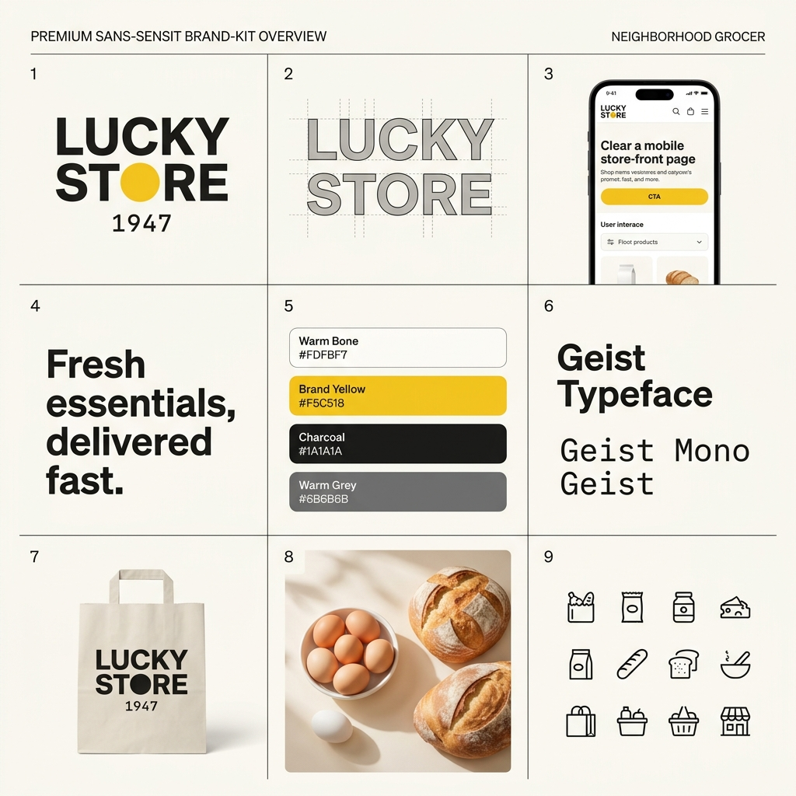

# Lucky Store 1947 — Brand Identity System (Yellow-Locked)

This document presents the definitive visual identity system for **Lucky Store 1947**, a premium neighborhood grocery institution.

The design system is purely **Sans-Serif**, conveying approachability, clarity, and modern trust as a friendly neighborhood institution. All Serif elements are banned.

---

## Brand Strategy & Design System

*   **Logo Style:** A bold, geometric sans-serif wordmark "LUCKY STORE" paired with a solid Brand Yellow dot (`#F5C518`) and a small, delicate monospace year "1947" below.
*   **Aesthetic Vibe:** Warm-minimalist, clean, tactile, and highly structural.
*   **Design Anchors:** Double-bezel cards (6px padding) and floating fluid-island navigation.

---

## Visual Presentation

---

## Brand Specifications

### 1. Color Palette (Yellow-Locked)

| Role | Token | Hex | Usage |
| :--- | :--- | :--- | :--- |
| Canvas / Background | `var(--color-paper)` | `#FDFBF7` | Warm bone white — softer than pure white |
| Primary Surface | `var(--color-surface)` | `#FFFFFF` | Clean, tactile product cards |
| Text Primary | `var(--color-foreground)` | `#1A1A1A` | Near-black for readability |
| Text Secondary | `var(--color-muted)` | `#6B6B6B` | Warm grey for metadata and secondary info |
| **Brand Yellow** | `var(--color-accent)` | **#F5C518** | **Primary accent — CTAs, badges, highlights, hover states** |
| Yellow Light | `var(--color-accent-muted)` | `#FFF8E1` | Soft yellow background tints, tags, highlights |
| Yellow Dark | `var(--color-accent-dark)` | `#C79400` | Deep yellow for high-contrast text on yellow tags |
| Structural Borders | `var(--color-border)` | `#E8E4DC` | Warm grey dividers — never cold `#E5E7EB` |
| Error / Alert | `var(--color-danger)` | `#DC2626` | Red for out-of-stock and system alerts |
| Success | `var(--color-success)` | `#16A34A` | Green for success checkmarks and delivery states |

### 2. Typography

*   **Display / Hero:** **Geist** | Weight: `800` | Size: `clamp(3rem, 8vw, 6rem)` | Tracking: `-0.03em` | Line-Height: `0.95`
*   **H1 Section:** **Geist** | Weight: `700` | Size: `clamp(2rem, 5vw, 3.5rem)` | Tracking: `-0.02em` | Line-Height: `1.1`
*   **H2 Card Title:** **Geist** | Weight: `600` | Size: `1.25rem` | Tracking: `-0.01em` | Line-Height: `1.3`
*   **Body:** **Geist** | Weight: `400` | Size: `1rem` | Tracking: `0` | Line-Height: `1.6`
*   **Mono / Price:** **Geist Mono** | Weight: `500` | Size: `1.125rem` | Tracking: `0.02em` | Line-Height: `1.2`
*   **Micro / Tags:** **Geist** | Weight: `500` | Size: `0.75rem` | Tracking: `0.05em` | Line-Height: `1.4`
*   **Bengali Fallback:** **Noto Sans Bengali** | Weight: `400-700` | Size: Matching | Tracking: `0` | Line-Height: `1.6`

---

## Technical Implementations

1.  **Tailwind Class Mapping:** All elements in the storefront codebase have been refactored to use Tailwind classes (`bg-warm-bg`, `text-warm-fg`, `text-warm-muted`, `border-warm-border`, `bg-warm-accent`, `font-body`, `font-mono`) to automatically inherit these design rules.
2.  **Double-Bezel Layout:** Cards use outer `#E8E4DC` bezels with concentric internal padding to emphasize structured craftsmanship.
3.  **Contrast Standards:** All text on Brand Yellow backgrounds uses `#1A1A1A` or deep `#C79400` to satisfy WCAG AA legibility targets.
