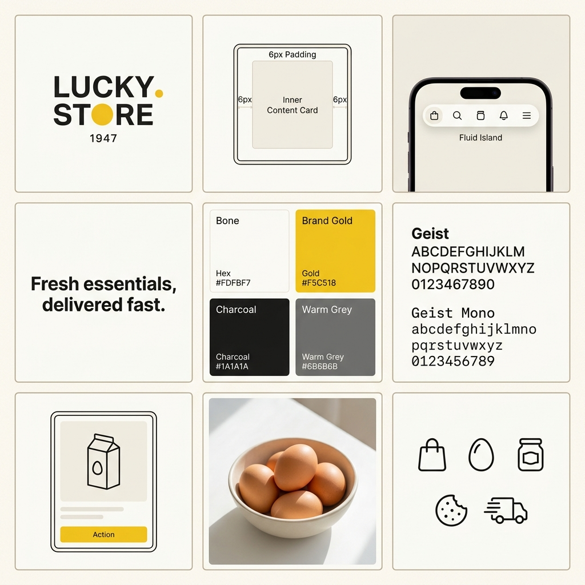

# Lucky Store 1947 — Storefront Brand Identity System

This document details the active storefront brand identity system for **Lucky Store 1947**, as currently implemented in the customer storefront application.

This system is characterized by a **Warm-Minimalist / Tactile Storefront** design language, combining modern editorial layout rules with physical shopkeeper cues.

---

## Brand Strategy & Design System

*   **Logo Style:** A clean, bold, sans-serif wordmark "LUCKY STORE" paired with a solid brand-gold dot (`#F5C518`) and a small, delicate monospace year "1947".
*   **Card Architecture:** The custom **"Double-Bezel"** component pattern. Every primary content card is nested in a dual-enclosure system to provide haptic depth.
*   **Navigation:** The **"Fluid Island"** navbar—a floating glass pill detached from the viewport edges.

---

## Visual Presentation

---

## Technical Specifications

### 1. Color Palette (As Implemented)
*   **Bone** (`#FDFBF7`): Main body background; soft, organic light surface that feels like premium paper.
*   **Brand Gold** (`#F5C518`): Primary brand action color, used on high-priority interactive states (buttons, active category pills, brand dot).
*   **Charcoal** (`#1A1A1A`): Primary text, headings, and high-contrast containers.
*   **Warm Grey** (`#6B6B6B`): Supporting text, secondary actions, and minor details.
*   **Warm Border** (`#E8E4DC`): Thin, clean dividers and outer bezel lines.

### 2. Double-Bezel Architecture
*   **Outer Bezel Wrapper:** `border: 1px solid #E8E4DC`, `padding: 6px`, `border-radius: 20px`, `background: #FFFFFF`.
*   **Inner Core Container:** `border-radius: 14px`, `box-shadow: inset 0 1px 1px rgba(255, 255, 255, 0.8)`, `padding: 16px`.

### 3. Typography
*   **Primary Sans-Serif:** **Geist**; used for highly legible interface labels, navigation, and body copy.
*   **Primary Monospace:** **Geist Mono**; used for prices, weights, years, badges, and numeric data.

### 4. Iconography
*   **Style:** Clean, lightweight vector lines (utilizing `@phosphor-icons/web` in bold weight).
*   **Core Icons:** Shopping bag, egg, jar, cookie, delivery truck.
